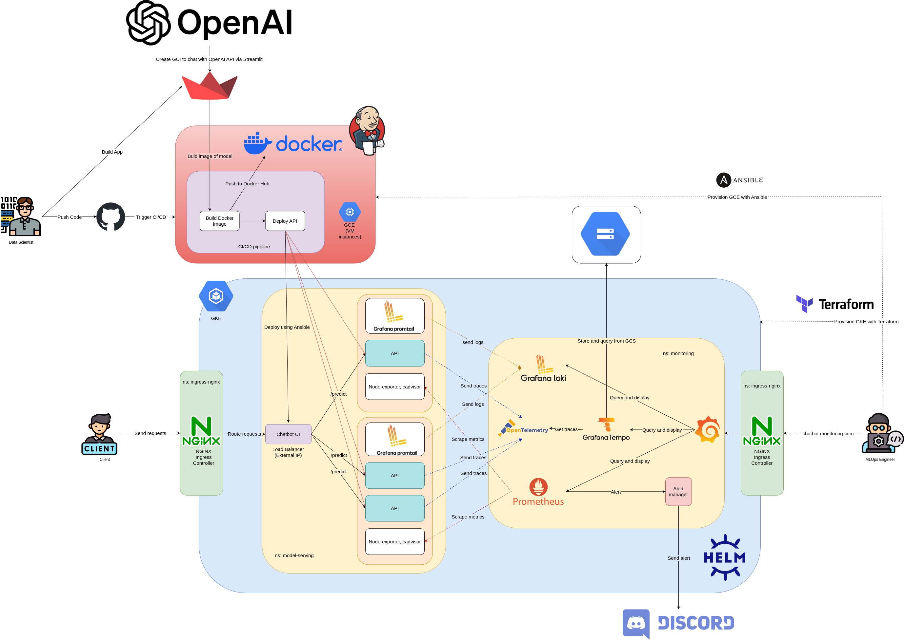
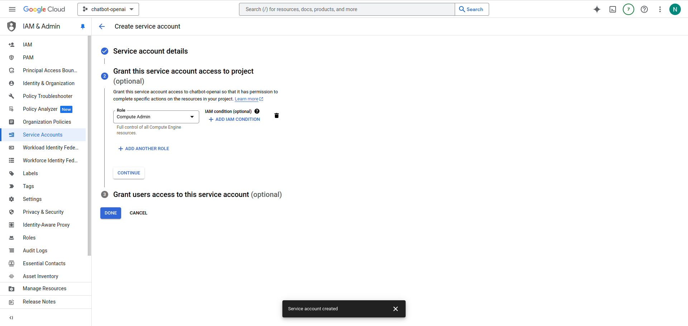
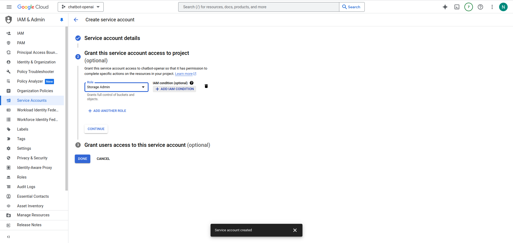
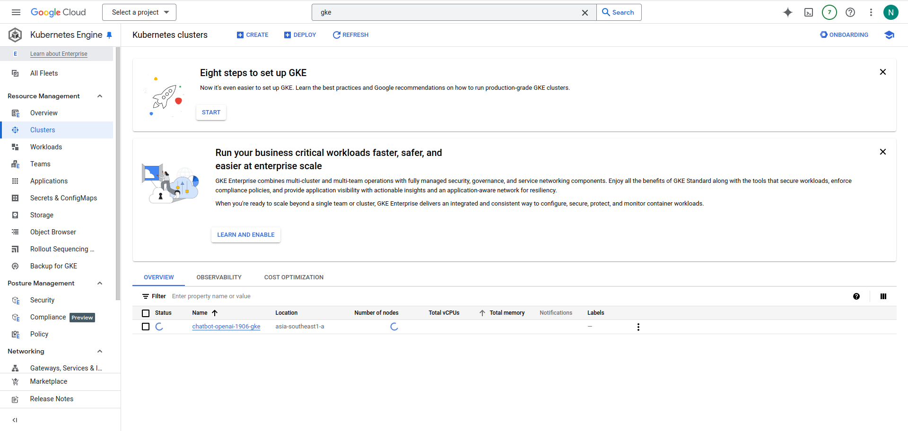
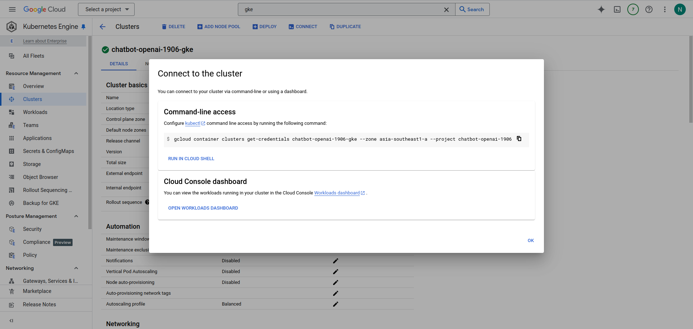
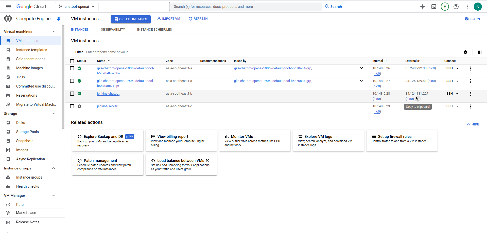
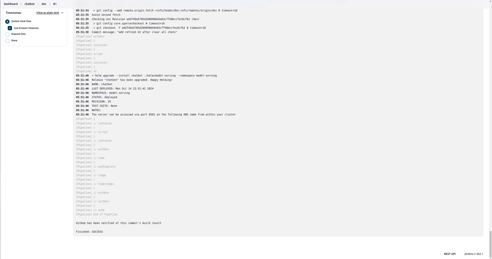
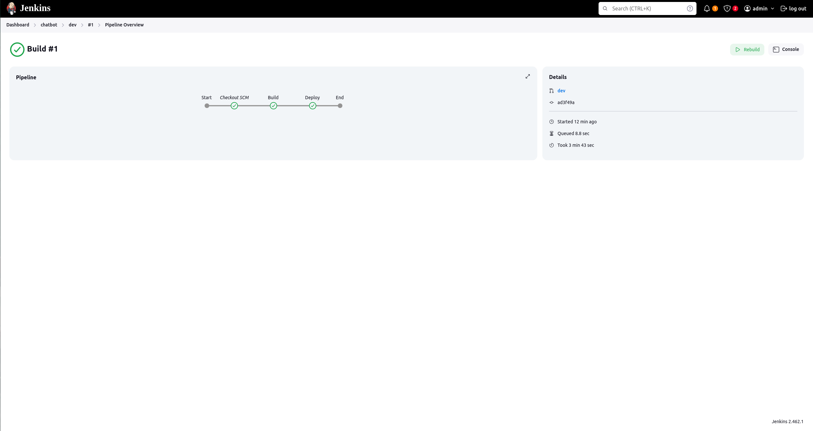

# Chatbot based on OpenAI API

## Introduction
This repository provides an in-depth overview and the necessary resources to deploy a highly scalable and efficient chatbot infrastructure. The system leverages a combination of cutting-edge tools and platforms, including Docker, Kubernetes, Ansible, Terraform, Grafana, Prometheus, and more. The architecture is designed to ensure seamless integration, deployment, monitoring, and management of the chatbot service.

## Table of Contents
1. 

## 1. Architecture Overview

The chatbot infrastructure is designed with a microservices architecture to ensure scalability and maintainability. The system comprises the following major components:

- **Chatbot based on OPEN API**: The custom chatbot service that interacts with the OpenAI API to generate responses to user queries.
- **Nginx Ingress Controller**: Routes client requests to the appropriate services within the Kubernetes cluster.
- **Chatbot UI**: The front-end interface of the chatbot built with Streamlit.
- **Monitoring Stack**: Composed of Grafana, Prometheus, Grafana Loki, Grafana Tempo, and Alertmanager for comprehensive monitoring and alerting.
- **CI/CD Pipeline**: Automates the build and deployment processes using GitHub, Jenkins, and Docker Hub.

## 2. Project Structure
```
.
├── app.py
├── BuildJenkins-Dockerfile
├── data
├── docker-compose.yaml
├── Dockerfile
├── helm
│   ├── model-serving
│   │   ├── Chart.yaml
│   │   ├── templates
│   │   └── values.yaml
│   ├── monitoring
│   │   ├── charts
│   │   ├── Chart.yaml
│   │   ├── templates
│   │   └── values.yaml
│   └── nginx-ingress
│       ├── Chart.yaml
│       ├── crds
│       ├── README.md
│       ├── templates
│       ├── values-icp.yaml
│       ├── values-nsm.yaml
│       ├── values-plus.yaml
│       ├── values.schema.json
│       └── values.yaml
├── iac
│   ├── ansible
│   │   ├── inventory
│   │   ├── playbooks
│   │   └── secrets
│   ├── requirements.txt
│   └── terraform
│       ├── main.tf
│       └── variables.tf
├── Jenkinsfile
├── Makefile
├── README.md
└── requirements.txt
```

<!-- ## Tools and Technologies
### Containerization and Orchestration
- **Docker**: Used for containerizing the chatbot application and its dependencies.
- **Kubernetes (GKE):** Manages the deployment, scaling, and operation of containerized applications.
Helm: Facilitates the management of Kubernetes applications.
 -->

## 3. Getting Started
#### 3.1. Create [Project](https://console.cloud.google.com/projectcreate) in GCP
#### 3.2. Install gcloud CLI
gcloud can be installed by following the instructions [here](https://cloud.google.com/sdk/docs/install).

After installing gcloud, run the following command to initialize the configuration:
```bash
gcloud init
Y
```

To login to your GCP account, run the following command:
```bash
gcloud auth application-default login
```

#### 3.3. Create service account and download the key
Create your own service account in  [here](https://console.cloud.google.com/iam-admin/serviceaccounts) and download the key in JSON format. In this project, we will create 2 service accounts, one for Ansible and the other for storing Tempo traces.
- For Ansible, you can create a service account with the **Compute Admin** role: 

- For Tempo, create a service account with the **Storage Admin** role:
 

After creating the service accounts, download the keys in JSON format and save them in the `iac/ansible/secrets` directory. You can save the key for Tempo at `helm/monitoring/charts/secrets` and add to your `custom.yaml` file in the service account section.

**Note:** These roles are just for demonstration purposes. You should assign the least privilege roles to the service accounts based on your requirements.

#### 3.4. Infrastructure Provisioning Using Terraform 
Navigate to the `iac/terraform` directory to initialize the Terraform configuration:
```bash
cd iac/terraform
terraform init
```

Update the `variables.tf` file with the necessary values for the project, region, and zone or anything else you want to change and use the following commands to plan and apply the Terraform configuration:
```bash
terraform plan
terraform apply
```
**Note:** In this project, I use Standard Mode of GKE to take advantage of its billing based on each node instead of pod like Autopilot. Moreover, using Autopilot mode would hinder the scraping of metrics from Prometheus nodes.<br>

During the cluster creation process, it may take anywhere from 15 to 20 minutes. You can monitor the progress through the GCP UI.

1. Go to the [Google Cloud Console](https://console.cloud.google.com/).
2. Select your project.
3. Navigate to the **Kubernetes Engine** section.
4. Click on **Clusters**.
5. Click on the cluster you created.
6. You will see the status of your cluster and can track its progress.



Once the cluster is successfully created, you can proceed to the next steps.

#### 3.5. Connect to the GKE Cluster
- From the GCP UI, click on the **Connect** button to get the command to connect to the cluster. Copy and paste the command in your terminal to connect to the cluster.

- Copy the command and paste it in your terminal to connect to the cluster.
- After run this command, you can connect to the cluster using the following command:
```bash
kubectx [YOUR_CLUSTER_ID]
```

### 4. Deploy services using Helm and kubectl
#### 4.1. Deploy Nginx Ingress Controller
Make sure you have Helm installed in your local machine. If not, you can install it by following the instructions [here](https://helm.sh/docs/intro/install/).<br>
Navigate to the `helm/nginx-ingress` directory and run the following commands to deploy the Nginx Ingress Controller:
```bash
cd helm/nginx-ingress
kubectl create namespace nginx-ingress
kubens nginx-ingress
helm upgrade --install nginx-ingress-controller . 
```
After that, Nginx Ingress Controller will be deployed in the `nginx-ingress` namespace. You can verify all resources in `nginx-ingress` namespace using the following command:
```bash
kubectl get all -n nginx-ingress
```

#### 4.2. Deploy application to GKE 
Navigate to the `helm/model-serving` directory and run the following commands to deploy the chatbot application:
```bash
cd helm/model-serving
kubectl create namespace model-serving
kubens model-serving
helm upgrade --install model-serving .
```
After that, the chatbot application will be deployed in the `model-serving` namespace. You can verify all resources in the `model-serving` namespace using the following command:
```bash
kubectl get all -n model-serving
```
If all resources are created successfully, you can access the chatbot application using the external IP of the Nginx Ingress Controller. You can get the external IP using the following command:
```bash
kubectl get ingress
```
You can also access the chatbot application using your own custom domain. You can update the `ingress.yaml` file in the `helm/model-serving/templates` directory with your custom domain and add the custom domain into `etc/hosts`:
```bash
sudo nano /etc/hosts
[YOUR_INGRESS_IP_ADDRESS] [YOUR_CUSTOM_DOMAIN]
```
After that, you can access the chatbot application using your custom domain. In my case, I use `chatbot.custom.com` as my custom domain.


#### 4.3. Deploy Monitoring Stack
For monitoring and logging
- Prometheus: Scrapes metrics from the chatbot application and infrastructure.
- Grafana: Visualizes metrics and logs, providing dashboards for monitoring system health.
- Grafana Loki: Collects and indexes logs from the application.
- Grafana Tempo: Provides tracing capabilities to monitor request flows and performance.
- Promtail: Collects logs from various sources and ships them to Grafana Loki for storage and querying.
- OpenTelemetry Collector: Receives, processes, and exports telemetry data (metrics, logs, traces) to observability backends, enabling a unified approach to monitoring and tracing.
- Alertmanager: Sends notifications based on Prometheus alerts to Discord.

Navigate to the `helm/monitoring` directory and run the following commands to create the monitoring namespace:
```bash
cd helm/monitoring
kubectl create namespace monitoring
kubens monitoring
```
Firstly, you can deploy the grafana using the following commands:
```bash
cd charts/grafana
helm upgrade --install grafana .
```
Secondly, you can deploy Grafana Tempo using the following commands:
```bash
cd charts/tempo
helm upgrade --install tempo . --values custom.yaml
```
Thirdly, you can deploy Grafana Loki using the following commands:
```bash
cd charts/loki-promtail
kubectl apply -f loki-config.yaml
kubectl apply -f promtail-config.yaml
```

Don't forget to deploy the OpenTelemetry Collector using the following commands:
```bash
cd charts/opentelemetry-collector
helm upgrade --install opentelemetry-collector . --values custom.yaml
```

You can deploy prometheus using the following commands:
```bash
cd charts/kubernetes-prometheus
kubectl apply -f prom-config-map.yaml
kubectl apply -f prometheus-clusterRole.yaml
kubectl apply -f deployment.yaml
kubectl apply -f service.yaml
```
You can deploy alertmanager using the following commands:
```bash
cd charts/kubernetes-prometheus
kubectl apply -f alertmanager-config-map.yaml
kubectl apply -f alertmanager-deploymetn.yaml
kubectl apply -f alertmanager-service.yaml
```
You can deploy node-exporter using the following commands:
```bash
cd charts/kubernetes-prometheus
kubectl apply -f node-exporter-daemonset.yaml
kubectl apply -f node-exporter-service.yaml
```

After that, the monitoring stack will be deployed in the `monitoring` namespace. You can verify all resources in the `monitoring` namespace using the following command:
```bash
kubectl get all -n monitoring
```

Like the chatbot application, you can access Grafana, Prometheus, and Tempo using the external IP of the Nginx Ingress Controller and use your own custom domain. You can get the external IP using the following command:
```bash
kubectl get ingress
```
After that, add the custom domain into `etc/hosts`:
```bash
sudo nano /etc/hosts
[YOUR_INGRESS_IP_ADDRESS] [YOUR_CUSTOM_DOMAIN]
```
After that, you can access Grafana, Prometheus, and Tempo using your custom domain. In my case, I use `chatbot.monitoring.custom.com` as my custom domain. Now, you can access Grafana to visualize and query logs from Loki, Tempo to trace the request flow, and Prometheus to monitor the system health.


**Note:** For demonstration purposes, I use the default username and password for Grafana. You should update the username and password in the `values.yaml` file in the `helm/monitoring/charts/grafana` directory.

### 5. CI/CD Pipeline with Jenkins
#### 5.1. Setup GCE Instance with Ansible
- In this project, I use Ansible to provision GCE instances and deploy Jenkins on the GCE instance.
- Please make sure that you have created a service account and already added ssh keys for connecting to the GCE instance, you can add your ssh keys in the `secrets` directory.
- After that, you can navigate to the `iac/ansible` directory and run the following commands to provision the GCE instance and deploy Jenkins:
```bash
cd iac/ansible
pip install -r requirements.txt
ansible-playbook playbooks/create_compute_instances.yaml
```

### 5.2 Install Docker and Jenkins on GCE Instance
- After provisioning the GCE instance, you can deploy Jenkins on the GCE instance using the following commands:
```bash
ansible-playbook playbooks/install_docker_jenkins.yaml
```

Once ansible playbook is executed successfully, you can see external IP of the GCE instance in the GCP UI. 


Connect to jenkins-chatbot instance  using the external IP address of the GCE instance by SSH protocol:
```bash
ssh [USERNAME]@[EXTERNAL_IP_ADDRESS]
```

You can check if Docker is installed successfully using the following command:
```bash
sudo docker ps
```

If Docker is installed successfully, you can follow the instructions [here](https://docs.docker.com/engine/install/linux-postinstall/) to run Docker as a non-root user after installing Docker on the GCE instance.

To use jenkins, you can access the Jenkins UI using [YOUR_EXTERNAL_IP_ADDRESS]:8081 in your browser. You can get the initial password from the GCE instance using the following commands:
```bash
docker exec -ti jenkins-chatbot 
cat /var/jenkins_home/secrets/initialAdminPassword
```
Copy the password and you can access Jenkins UI.

It will take a few minutes for Jenkins to be set up successfully on VM instance.


Let's continue as admin and install the suggested plugins.

### 5.3. Setup Jenkins Pipeline
#### 5.3.1 Install Jenkins plugins
Go to Manage Jenkins > Plugins > Available plugins. Then, install these plugins: Docker, Docker Pipeline, Kubernetes. Then, restart your Jenkins container.


#### 5.3.2 Create Github Access Token
Go to Settings > Developer Settings > Personal Access Tokens > Tokens (classic) > Generate new token > Generate new token (classic).<br>
**Note:** Please select only the appropriate permissions for your token.


#### 5.3.3 Create Docker Hub Access Token
Go to Account Settings > Personal Access Token > Generate New Token.


#### 5.3.4 Create Webhook in Github
Go to your repository > Settings > Webhooks > Add webhook. Then, add the Jenkins URL and append `/github-webhook/` at the end of the URL. You can also add a secret token for security purposes.


#### 5.3.4 Create Jenkins Pipeline
First of all, let grant permissions to the service account which is trying to connect to our cluster by the following command:
```bash
kubectl create ns model-serving
kubectl create clusterrolebinding model-serving-admin-binding \
  --clusterrole=admin \
  --serviceaccount=model-serving:default \
  --namespace=model-serving

kubectl create clusterrolebinding anonymous-admin-binding \
  --clusterrole=admin \
  --user=system:anonymous \
  --namespace=model-serving
```

**Note:** You should not grant admin permissions to the service account in production environments. You should assign the least privilege roles to the service accounts based on your requirements.


Next, let get your certificate key and cluster url from with the following command:
```bash
 ~/.kube/config.
 ```
Then, go to Manage Jenkins > Cloud > New cloud.


#### 5.3.5 Install Helm on Jenkins to enable CI/CD pipeline
You can use the `BuildJenkins-Dockerfile` to build a new Docker image. After that, push this newly created image to Dockerhub. Finally replace the image reference at containerTemplate in Jenkinsfile or you can reuse my image minhquan1906/jenkins:lts-jdk17.

#### 5.3.6 Create CI/CD Jenkins Pipeline
The CI/CD pipeline will consist of two stages:

- Building the image, and pushing the image to Docker Hub.
- Deploying the application with the latest image from DockerHub to GKE cluster.

Now, let create our pipeline. Go to New Item > Multibranch Pipeline and add your github url, github token and dockerhub token.


The pipeline will take about 5 - 10 minutes. You can confirm the successful deployment of the application to the GKE cluster if you see the following output in the pipeline log:


Here is the Stage View in Jenkins Pipeline:


Now, you have successfulle run your CICD pipeline with Jenkins. Let checkout whether the pods have been deployed successfully in the model-serving namespace.
```bash
kubectl get pods -n model-serving
```
You can test our app by typing chatbot.custom.com on your web browser.